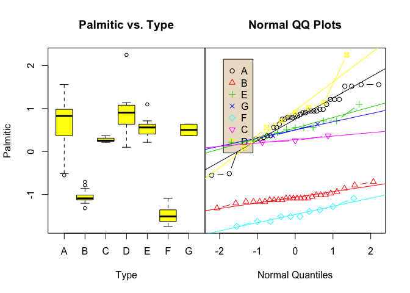
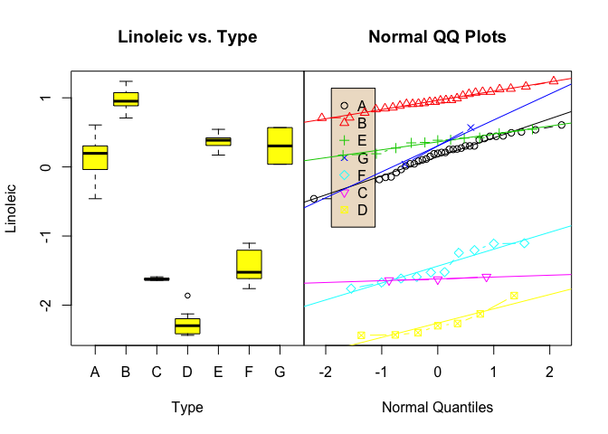
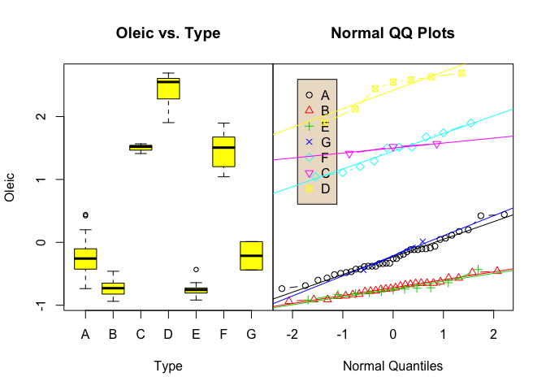
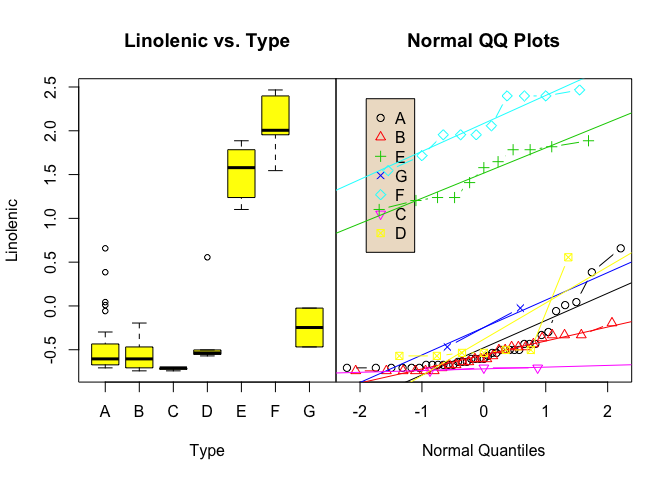
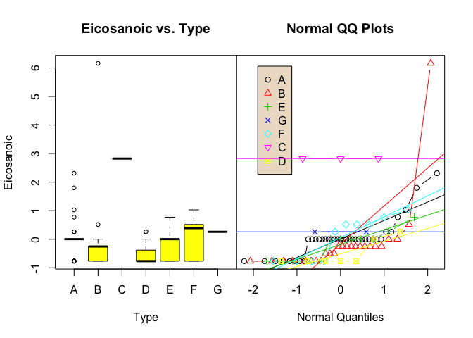
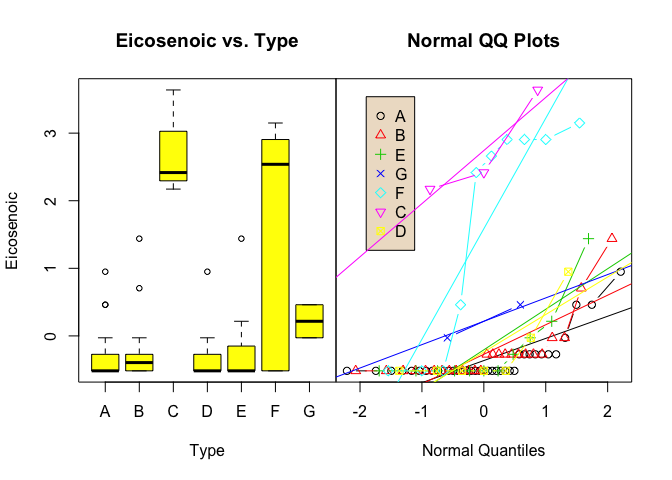

TYPE OF OIL BASED FATTY ACID CONTENT
====================================

1. [Data](#data)
2. [Data Preparation](#data-preparation)
    - [Train/Validation Split](#train/validation-split)
     - [Model Building](#model-building)


``` r
#Libraries:
require(kknn)
require(class)
require(klaR)
require(e1071)
require(s20x)
```

Data
----

The file <b>Oils.csv</b> contains fatty acid content readings for
samples of seven types of oils (pumpkin, sunflower, peanut, olive,
soybean, rapeseed, and corn). The fatty acids measured are: Palmitic,
Stearic, Oleic, Linoleic, Linolenic, Eicosanoic, and Eicosenoic.

``` r
setwd(getwd())
Oils =read.csv("Oils.csv")
summary(Oils)
```

    ##  Type      Palmitic        Stearic          Oleic          Linoleic    
    ##  A:37   Min.   : 4.50   Min.   :1.700   Min.   :22.80   Min.   : 7.90  
    ##  B:26   1st Qu.: 6.20   1st Qu.:3.475   1st Qu.:26.30   1st Qu.:43.10  
    ##  C: 3   Median : 9.85   Median :4.200   Median :30.70   Median :50.80  
    ##  D: 7   Mean   : 9.04   Mean   :4.200   Mean   :36.73   Mean   :46.49  
    ##  E:11   3rd Qu.:11.12   3rd Qu.:5.000   3rd Qu.:38.62   3rd Qu.:58.08  
    ##  F:10   Max.   :14.90   Max.   :6.700   Max.   :76.70   Max.   :66.10  
    ##  G: 2                                                                  
    ##    Linolenic       Eicosanoic      Eicosenoic    
    ##  Min.   :0.100   Min.   :0.100   Min.   :0.1000  
    ##  1st Qu.:0.375   1st Qu.:0.100   1st Qu.:0.1000  
    ##  Median :0.800   Median :0.400   Median :0.1000  
    ##  Mean   :2.272   Mean   :0.399   Mean   :0.3115  
    ##  3rd Qu.:2.650   3rd Qu.:0.400   3rd Qu.:0.3000  
    ##  Max.   :9.500   Max.   :2.800   Max.   :1.8000  
    ## 

Data Preparation
----------------

### Train/Validation Split

It wouldn’t be wise to split the data into train and validation sets as
we only have a total of 96 observations in the original dataset. The
decision making factor for not splitting the data is the amount of
observations representing each class. There is 7 classes of Type
categorical variable. Splitting the dataset with stratifying the Type
variable could be a potential problem-solver as it would keep the same
proportion of observations belonging to each class. However, as we can
see (below) the low level of counts of each class below, it is not
doable to make each cateogry representative of the data if we attempted
a train/validation set split.

``` r
summary(Oils$Type)
```

    ##  A  B  C  D  E  F  G 
    ## 37 26  3  7 11 10  2

### Standardizing

All our predicotrs are numeric variables. Their scales differ a little
bit, and as we are going to be using k-nearest neighbors to classify our
observations, we will be working with straight line distance metrics -
so we are going to standardize our data (mean=0, stdev=1). It is crucial
when using k-nearest neighbors approach.

``` r
Oils[,2:8] = scale(Oils[,2:8])
set.seed(888)
```

Model building
--------------

We will be using k-NN and Naïve Bayes to classify the training data.

### Unweighted kNN

Let’s start with a simple, unweighted k-NN classification model. For
this, we will use sknn() function from the klaR library.

Gamma parameter is a tunning parameter. Gamma = 0 gives us the
unweighted model. As gamma increases, the more down-weighted we get,
with weights dropping very fast.

``` r
#Nearest Neighbors (k=1)
oils.sknn = sknn(Type~., data = Oils, kn=1)
```

``` r
ypred = predict(oils.sknn)
```

predict() function returns two attributes: posterior and class.
Posterior is a predicted probability of the observation being in each
class; class gives us a predicted class.

Let’s look at the missclassfication rate using the following function:

``` r
misclass = function(fit,y) {
temp <- table(fit,y)
cat("Table of Misclassification\n")
cat("(row = predicted, col = actual)\n")
print(temp)
cat("\n\n")
numcor <- sum(diag(temp))
numinc <- length(y) - numcor
mcr <- numinc/length(y)
cat(paste("Misclassification Rate = ",format(mcr,digits=3)))
cat("\n")
}
```

``` r
#Nearest Neighbors (k=1)
misclass(ypred$class,Oils$Type)
```

    ## Table of Misclassification
    ## (row = predicted, col = actual)
    ##    y
    ## fit  A  B  C  D  E  F  G
    ##   A 37  0  0  0  0  0  0
    ##   B  0 26  0  0  0  0  0
    ##   C  0  0  3  0  0  0  0
    ##   D  0  0  0  7  0  0  0
    ##   E  0  0  0  0 11  0  0
    ##   F  0  0  0  0  0 10  0
    ##   G  0  0  0  0  0  0  2
    ## 
    ## 
    ## Misclassification Rate =  0

``` r
#Nearest Neighbors (k=2)
oils.sknn = sknn(Type~., data = Oils, kn=2)
misclass(predict(oils.sknn)$class,Oils$Type)
```

    ## Table of Misclassification
    ## (row = predicted, col = actual)
    ##    y
    ## fit  A  B  C  D  E  F  G
    ##   A 37  0  0  0  0  0  0
    ##   B  0 26  0  0  0  0  0
    ##   C  0  0  3  0  0  0  0
    ##   D  0  0  0  6  0  0  0
    ##   E  0  0  0  0 11  0  0
    ##   F  0  0  0  1  0 10  0
    ##   G  0  0  0  0  0  0  2
    ## 
    ## 
    ## Misclassification Rate =  0.0104

``` r
#Nearest Neighbors (k=3)
oils.sknn = sknn(Type~., data = Oils, kn=3)
misclass(predict(oils.sknn)$class,Oils$Type)
```

    ## Table of Misclassification
    ## (row = predicted, col = actual)
    ##    y
    ## fit  A  B  C  D  E  F  G
    ##   A 37  1  0  0  0  0  0
    ##   B  0 25  0  0  0  0  0
    ##   C  0  0  3  0  0  0  0
    ##   D  0  0  0  7  0  0  0
    ##   E  0  0  0  0 11  0  0
    ##   F  0  0  0  0  0 10  0
    ##   G  0  0  0  0  0  0  2
    ## 
    ## 
    ## Misclassification Rate =  0.0104

``` r
#Nearest Neighbors (k=4)
oils.sknn = sknn(Type~., data = Oils, kn=4)
misclass(predict(oils.sknn)$class,Oils$Type)
```

    ## Table of Misclassification
    ## (row = predicted, col = actual)
    ##    y
    ## fit  A  B  C  D  E  F  G
    ##   A 35  0  0  0  0  0  0
    ##   B  1 25  0  0  0  0  0
    ##   C  0  1  3  0  0  0  0
    ##   D  0  0  0  7  0  0  0
    ##   E  1  0  0  0 11  0  0
    ##   F  0  0  0  0  0 10  0
    ##   G  0  0  0  0  0  0  2
    ## 
    ## 
    ## Misclassification Rate =  0.0312

``` r
#Nearest Neighbors (k=5)
oils.sknn = sknn(Type~., data = Oils, kn=5)
misclass(predict(oils.sknn)$class,Oils$Type)
```

    ## Table of Misclassification
    ## (row = predicted, col = actual)
    ##    y
    ## fit  A  B  C  D  E  F  G
    ##   A 35  0  0  0  0  0  0
    ##   B  1 25  0  0  0  0  1
    ##   C  0  1  3  0  0  0  0
    ##   D  0  0  0  7  0  0  0
    ##   E  1  0  0  0 11  0  0
    ##   F  0  0  0  0  0 10  0
    ##   G  0  0  0  0  0  0  1
    ## 
    ## 
    ## Misclassification Rate =  0.0417

``` r
#Nearest Neighbors (k=6)
oils.sknn = sknn(Type~., data = Oils, kn=6)
misclass(predict(oils.sknn)$class,Oils$Type)
```

    ## Table of Misclassification
    ## (row = predicted, col = actual)
    ##    y
    ## fit  A  B  C  D  E  F  G
    ##   A 34  0  0  0  0  0  0
    ##   B  2 25  0  0  0  0  1
    ##   C  0  1  3  0  0  0  0
    ##   D  0  0  0  7  0  0  0
    ##   E  1  0  0  0 11  0  1
    ##   F  0  0  0  0  0 10  0
    ##   G  0  0  0  0  0  0  0
    ## 
    ## 
    ## Misclassification Rate =  0.0625

The model with k=1 nearest neighbor is performing the best. However,
when we use 1-nearest neighbor classifier, there is a high likelihood we
are encountering overfitting of our data. Estimating the probability
based on a single sample (first closest neighbor) is sensitive to noise,
missclassification, When we use larger k values, we increase the
robustness of our model, as then our decision surface gets smoother.
However, for larger k values, our missclassificaiton rate was
increasing.

k=2 and k=3 were having the same performance. We are going to keep kn=3
in our model. Let’s implement weighing into our model and see if that
can improve it. We are not going to be considering kn=1 from now on.

### Weighted kNN

``` r
#Nearest Neighbors (k=2, gamma=1)
oils.sknn = sknn(Type~., data = Oils, kn=3, gamma = 1)
misclass(predict(oils.sknn)$class,Oils$Type)
```

    ## Table of Misclassification
    ## (row = predicted, col = actual)
    ##    y
    ## fit  A  B  C  D  E  F  G
    ##   A 37  0  0  0  0  0  0
    ##   B  0 26  0  0  0  0  0
    ##   C  0  0  3  0  0  0  0
    ##   D  0  0  0  7  0  0  0
    ##   E  0  0  0  0 11  0  0
    ##   F  0  0  0  0  0 10  0
    ##   G  0  0  0  0  0  0  2
    ## 
    ## 
    ## Misclassification Rate =  0

``` r
#Nearest Neighbors (k=3, gamma=2)
oils.sknn = sknn(Type~., data = Oils, kn=3, gamma=2)
misclass(predict(oils.sknn)$class,Oils$Type)
```

    ## Table of Misclassification
    ## (row = predicted, col = actual)
    ##    y
    ## fit  A  B  C  D  E  F  G
    ##   A 37  0  0  0  0  0  0
    ##   B  0 26  0  0  0  0  0
    ##   C  0  0  3  0  0  0  0
    ##   D  0  0  0  7  0  0  0
    ##   E  0  0  0  0 11  0  0
    ##   F  0  0  0  0  0 10  0
    ##   G  0  0  0  0  0  0  2
    ## 
    ## 
    ## Misclassification Rate =  0

``` r
#Nearest Neighbors (k=4, gamma=3)
oils.sknn = sknn(Type~., data = Oils, kn=3, gamma = 3)
misclass(predict(oils.sknn)$class,Oils$Type)
```

    ## Table of Misclassification
    ## (row = predicted, col = actual)
    ##    y
    ## fit  A  B  C  D  E  F  G
    ##   A 37  0  0  0  0  0  0
    ##   B  0 26  0  0  0  0  0
    ##   C  0  0  3  0  0  0  0
    ##   D  0  0  0  7  0  0  0
    ##   E  0  0  0  0 11  0  0
    ##   F  0  0  0  0  0 10  0
    ##   G  0  0  0  0  0  0  2
    ## 
    ## 
    ## Misclassification Rate =  0

``` r
#Nearest Neighbors (k=5, gamma=4)
oils.sknn = sknn(Type~., data = Oils, kn=3, gamma=4)
misclass(predict(oils.sknn)$class,Oils$Type)
```

    ## Table of Misclassification
    ## (row = predicted, col = actual)
    ##    y
    ## fit  A  B  C  D  E  F  G
    ##   A 37  0  0  0  0  0  0
    ##   B  0 26  0  0  0  0  0
    ##   C  0  0  3  0  0  0  0
    ##   D  0  0  0  7  0  0  0
    ##   E  0  0  0  0 11  0  0
    ##   F  0  0  0  0  0 10  0
    ##   G  0  0  0  0  0  0  2
    ## 
    ## 
    ## Misclassification Rate =  0

``` r
#Nearest Neighbors (k=4, gamma=1)
oils.sknn = sknn(Type~., data = Oils, kn=4, gamma=1)
misclass(predict(oils.sknn)$class,Oils$Type)
```

    ## Table of Misclassification
    ## (row = predicted, col = actual)
    ##    y
    ## fit  A  B  C  D  E  F  G
    ##   A 37  0  0  0  0  0  0
    ##   B  0 26  0  0  0  0  0
    ##   C  0  0  3  0  0  0  0
    ##   D  0  0  0  7  0  0  0
    ##   E  0  0  0  0 11  0  0
    ##   F  0  0  0  0  0 10  0
    ##   G  0  0  0  0  0  0  2
    ## 
    ## 
    ## Misclassification Rate =  0

``` r
#Nearest Neighbors (k=5, gamma=1)
oils.sknn = sknn(Type~., data = Oils, kn=5, gamma=1)
misclass(predict(oils.sknn)$class,Oils$Type)
```

    ## Table of Misclassification
    ## (row = predicted, col = actual)
    ##    y
    ## fit  A  B  C  D  E  F  G
    ##   A 37  0  0  0  0  0  0
    ##   B  0 26  0  0  0  0  0
    ##   C  0  0  3  0  0  0  0
    ##   D  0  0  0  7  0  0  0
    ##   E  0  0  0  0 11  0  0
    ##   F  0  0  0  0  0 10  0
    ##   G  0  0  0  0  0  0  2
    ## 
    ## 
    ## Misclassification Rate =  0

``` r
#Nearest Neighbors (k=6, gamma=1)
oils.sknn = sknn(Type~., data = Oils, kn=6, gamma=1)
misclass(predict(oils.sknn)$class,Oils$Type)
```

    ## Table of Misclassification
    ## (row = predicted, col = actual)
    ##    y
    ## fit  A  B  C  D  E  F  G
    ##   A 36  0  0  0  0  0  0
    ##   B  1 26  0  0  0  0  0
    ##   C  0  0  3  0  0  0  0
    ##   D  0  0  0  7  0  0  0
    ##   E  0  0  0  0 11  0  0
    ##   F  0  0  0  0  0 10  0
    ##   G  0  0  0  0  0  0  2
    ## 
    ## 
    ## Misclassification Rate =  0.0104

``` r
#Nearest Neighbors (k=6, gamma=2)
oils.sknn = sknn(Type~., data = Oils, kn=6, gamma=2)
misclass(predict(oils.sknn)$class,Oils$Type)
```

    ## Table of Misclassification
    ## (row = predicted, col = actual)
    ##    y
    ## fit  A  B  C  D  E  F  G
    ##   A 37  0  0  0  0  0  0
    ##   B  0 26  0  0  0  0  0
    ##   C  0  0  3  0  0  0  0
    ##   D  0  0  0  7  0  0  0
    ##   E  0  0  0  0 11  0  0
    ##   F  0  0  0  0  0 10  0
    ##   G  0  0  0  0  0  0  2
    ## 
    ## 
    ## Misclassification Rate =  0

As seen above, using any combination of the number of nearest neighbors
(kn = {1,6}) and gamma parameter (weighing), our missclassification rate
is 0.

### Distance metric Tunning

Let’s experiment with Minkowski distance metric.

``` r
oils.kknn = train.kknn(Type~.,data=Oils, kn=3, kernel=c("optimal"), distance = 1)  
misclass(predict(oils.kknn, newdata = Oils), Oils$Type)
```

    ## Table of Misclassification
    ## (row = predicted, col = actual)
    ##    y
    ## fit  A  B  C  D  E  F  G
    ##   A 37  0  0  0  0  0  0
    ##   B  0 26  0  0  0  0  0
    ##   C  0  0  3  0  0  0  0
    ##   D  0  0  0  7  0  0  0
    ##   E  0  0  0  0 11  0  0
    ##   F  0  0  0  0  0 10  0
    ##   G  0  0  0  0  0  0  2
    ## 
    ## 
    ## Misclassification Rate =  0

``` r
oils.kknn = train.kknn(Type~.,data=Oils, kn=3, kernel=c("optimal"), distance = 2)  
misclass(predict(oils.kknn, newdata = Oils), Oils$Type)
```

    ## Table of Misclassification
    ## (row = predicted, col = actual)
    ##    y
    ## fit  A  B  C  D  E  F  G
    ##   A 37  0  0  0  0  0  0
    ##   B  0 26  0  0  0  0  0
    ##   C  0  0  3  0  0  0  0
    ##   D  0  0  0  7  0  0  0
    ##   E  0  0  0  0 11  0  0
    ##   F  0  0  0  0  0 10  0
    ##   G  0  0  0  0  0  0  2
    ## 
    ## 
    ## Misclassification Rate =  0

``` r
oils.kknn = train.kknn(Type~.,data=Oils, kn=3, kernel=c("optimal"), distance = 3)  
misclass(predict(oils.kknn, newdata = Oils), Oils$Type)
```

    ## Table of Misclassification
    ## (row = predicted, col = actual)
    ##    y
    ## fit  A  B  C  D  E  F  G
    ##   A 37  0  0  0  0  0  0
    ##   B  0 26  0  0  0  0  0
    ##   C  0  0  3  0  0  0  0
    ##   D  0  0  0  7  0  0  0
    ##   E  0  0  0  0 11  0  0
    ##   F  0  0  0  0  0 10  0
    ##   G  0  0  0  0  0  0  2
    ## 
    ## 
    ## Misclassification Rate =  0

Putting more emphasis on Mikowski distance isn’t chaning the
missclassificaiton rate, perhaps modifying the kernel will make a
difference.

### Kernel Tunning

``` r
oils.kknn = train.kknn(Type~.,data=Oils, kn=3, kernel=c("triangular"), distance = 1, gamma = 1)  
misclass(predict(oils.kknn, newdata = Oils), Oils$Type)
```

    ## Table of Misclassification
    ## (row = predicted, col = actual)
    ##    y
    ## fit  A  B  C  D  E  F  G
    ##   A 37  0  0  0  0  0  0
    ##   B  0 26  0  0  0  0  0
    ##   C  0  0  3  0  0  0  0
    ##   D  0  0  0  7  0  0  0
    ##   E  0  0  0  0 11  0  0
    ##   F  0  0  0  0  0 10  0
    ##   G  0  0  0  0  0  0  2
    ## 
    ## 
    ## Misclassification Rate =  0

``` r
oils.kknn = train.kknn(Type~.,data=Oils, kn=3, kernel=c( "rectangular", "epanechnikov", "optimal", "triweight")) 
misclass(predict(oils.kknn, newdata = Oils), Oils$Type)
```

    ## Table of Misclassification
    ## (row = predicted, col = actual)
    ##    y
    ## fit  A  B  C  D  E  F  G
    ##   A 37  0  0  0  0  0  0
    ##   B  0 26  0  0  0  0  0
    ##   C  0  0  3  0  0  0  0
    ##   D  0  0  0  7  0  0  0
    ##   E  0  0  0  0 11  0  0
    ##   F  0  0  0  0  0 10  0
    ##   G  0  0  0  0  0  0  2
    ## 
    ## 
    ## Misclassification Rate =  0

``` r
oils.kknn = train.kknn(Type~.,data=Oils, kn=3,kernel=c("triangular", "rectangular", "epanechnikov", "optimal", "triweight", "gaussian"), distance = 1)
misclass(predict(oils.kknn, newdata = Oils), Oils$Type)
```

    ## Table of Misclassification
    ## (row = predicted, col = actual)
    ##    y
    ## fit  A  B  C  D  E  F  G
    ##   A 37  0  0  0  0  0  0
    ##   B  0 26  0  0  0  0  0
    ##   C  0  0  3  0  0  0  0
    ##   D  0  0  0  7  0  0  0
    ##   E  0  0  0  0 11  0  0
    ##   F  0  0  0  0  0 10  0
    ##   G  0  0  0  0  0  0  2
    ## 
    ## 
    ## Misclassification Rate =  0

Any of the weighted knn approaches give <b>NO missclassifications</b> on
the training data. However we cannot know whether our model could be
underfitting (having a high bias and low variance) or overfitting (low
bias and high variance) as we are not predicting on a different training
data set (validation set).

### Parameter Grid Search

As seen above, there is many many possible combinations to find optimal
paramters. Let’s use a very handy parameter grid search tool to have it
find the best combination of tunning parameters for us.

This function tune() is in the package called “e1071”

First, we need to form our resposne vector ‘y’ and a data frame ‘x’ of
our predictors.

``` r
y = Oils[,1]
x = Oils[,-1]
```

Here, we have to be using knn() function to fit kNN classifier.
Parameter ‘l’ specifies the minimum vote for the definite decision when
there is a tie. If it’s null, there is a doubt (Unkown “?”).

``` r
require(e1071)
tuned = tune.knn(x,y, k=2:15, tunecontrol = tune.control(sampling = "boot"), data = Oils)
summary(tuned)
```

    ## 
    ## Parameter tuning of 'knn.wrapper':
    ## 
    ## - sampling method: bootstrapping 
    ## 
    ## - best parameters:
    ##  k
    ##  2
    ## 
    ## - best performance: 0.05658845 
    ## 
    ## - Detailed performance results:
    ##     k      error dispersion
    ## 1   2 0.05658845 0.04002710
    ## 2   3 0.07963144 0.04303830
    ## 3   4 0.07191869 0.04552598
    ## 4   5 0.09202561 0.04241690
    ## 5   6 0.08829502 0.04337019
    ## 6   7 0.08659200 0.03156927
    ## 7   8 0.10613285 0.05191130
    ## 8   9 0.10301632 0.04506711
    ## 9  10 0.11843671 0.06256548
    ## 10 11 0.13581071 0.07252040
    ## 11 12 0.14784282 0.08334833
    ## 12 13 0.16519908 0.09083289
    ## 13 14 0.17542751 0.10187148
    ## 14 15 0.19004858 0.10889051

Seems like lower k values are classifying our problem better. Also, this
function is not so useful as intially thought - it does not search for
optimal weighting gamma parameter or kernels. It is good, however, for a
quick look at the performance of different number of nearest neighbors.

### Monte-Carlo Cross Validation for k-NN

As we mentioned above, Cross Validation is very important to measure
accuracy of our model and see whether we have an optimal bias-variance
trade-off.

We will randomly split the Oils data B times into training and
validation sets using Monte-Carlo Cross Validation functions below.

``` r
#For uing kknn()
kknn.cv = function(train,y=train[,1],B=25,p=.333,kmax=3,kernel="optimal",distance=2) {
  y = as.factor(y)
  data = data.frame(y=y,train[,-1])
  n = length(y)
  cv <- rep(0,B)
  leaveout = floor(n*p)
  for (i in 1:B) {
    sam <- sample(1:n,leaveout,replace=F)
    fit <- train.kknn(y~.,data=data[-sam,],kmax=kmax,kernel=kernel,distance=distance)
    ypred = predict(fit,newdata=data[sam,])
    tab <- table(y[sam],ypred)
    mc <- leaveout - sum(diag(tab))
    cv[i] <- mc/leaveout
  }
  cv
}

#For using sknn()
sknn.cv = function(train,y=train[,1],B=25,p=.333,k=3,gamma=0) {
y = as.factor(y)
data = data.frame(y,train)
n = length(y)
cv <- rep(0,B)
leaveout = floor(n*p)
for (i in 1:B) {
        sam <- sample(1:n,leaveout,replace=F)
        temp <- data[-sam,]
        fit <- sknn(y~.,data=temp,kn=k,gamma=gamma)
        pred = predict(fit,newdata=train[sam,])$class
        tab <- table(y[sam],pred)
        mc <- leaveout - sum(diag(tab))
        cv[i] <- mc/leaveout
        }
  cv
}
```

The data frame needs to have the response as the first variable for the
functions above.

#### For sknn

train,y=train\[,1\],B=25,p=.333,k=3,gamma=0)

``` r
set.seed(888)
results = sknn.cv(Oils,B=25,k=3,gamma=0)
summary(results)
```

    ##    Min. 1st Qu.  Median    Mean 3rd Qu.    Max. 
    ## 0.00000 0.00000 0.03226 0.04774 0.06452 0.22581

``` r
set.seed(888)
results = sknn.cv(Oils,B=500,k=3,gamma=1)
summary(results)
```

    ##    Min. 1st Qu.  Median    Mean 3rd Qu.    Max. 
    ## 0.00000 0.00000 0.00000 0.02077 0.03226 0.12903

``` r
set.seed(888)
results = sknn.cv(Oils,B=500,k=3,gamma=2)
summary(results)
```

    ##    Min. 1st Qu.  Median    Mean 3rd Qu.    Max. 
    ## 0.00000 0.00000 0.00000 0.02090 0.03226 0.12903

``` r
set.seed(888)
results = sknn.cv(Oils,B=500,k=5,gamma=2)
summary(results)
```

    ##    Min. 1st Qu.  Median    Mean 3rd Qu.    Max. 
    ## 0.00000 0.00000 0.00000 0.01968 0.03226 0.16129

Best metrics for k=3 with gamma=2 (M=0.01032) and k=5 with gamma=2
(M=0.0129)

#### For kknn

``` r
set.seed(888)
results = kknn.cv(Oils,B=10,kmax=15,kernel="optimal")
summary(results)
```

    ##    Min. 1st Qu.  Median    Mean 3rd Qu.    Max. 
    ## 0.00000 0.03226 0.03226 0.03548 0.05645 0.06452

``` r
set.seed(888)
results = kknn.cv(Oils,B=10,kmax=4,kernel="triangular")
summary(results)
```

    ##    Min. 1st Qu.  Median    Mean 3rd Qu.    Max. 
    ## 0.00000 0.00000 0.01613 0.02258 0.03226 0.06452

``` r
set.seed(888)
results = kknn.cv(Oils,B=10,kmax=10,kernel="triangular",distance=1) 
summary(results)
```

    ##    Min. 1st Qu.  Median    Mean 3rd Qu.    Max. 
    ## 0.00000 0.00000 0.01613 0.02258 0.03226 0.06452

``` r
set.seed(888)
results = kknn.cv(Oils,B=15,kmax=5,kernel="triangular",distance=1) 
summary(results)
```

    ##    Min. 1st Qu.  Median    Mean 3rd Qu.    Max. 
    ## 0.00000 0.00000 0.00000 0.01935 0.03226 0.06452

``` r
set.seed(888)
results = kknn.cv(Oils,B=10,kmax=10,kernel=c("triangular", "rectangular", "epanechnikov", "optimal", "triweight", "gaussian"),distance=1)
summary(results)
```

    ##    Min. 1st Qu.  Median    Mean 3rd Qu.    Max. 
    ## 0.00000 0.00000 0.01613 0.02258 0.03226 0.06452

Metrics for sknn were of better performance.

### Naive Bayes

Which type of Oils has the highest posterior probability of being
observed given the data? fL = tunning parameter Laplace

#### Normal Distribution

Which of the fatty acids have the best discriminatory ability in
classying which type of Oil it is? Let’s look at two examples.

``` r
boxqq(Palmitic~Type, data=Oils)
```



High levels are associated with the given type. For example, for
Palmitic fatty acid, we can see it would most likley be associated with
Type D. And vice-versa, if the Linoleic levels are low, there is a good
chance, they are associated with Type D (as seen below).

For Palmitic, there is a tiny bit of right skewness for Type B and left
skewness for Type A and D (with D seeming to have an outlier).

``` r
boxqq(Linoleic~Type, data=Oils)
```



For Linoleic fatty acid content, normality looks pretty okay across the
seven Type categories (Type F looks a bit skewed right).

``` r
boxqq(Stearic~Type, data=Oils)
```


For Stearic fatty acid content, we see that the Type A and B are right
skewed.

``` r
boxqq(Oleic~Type, data=Oils)
```



For Oleic fatty acid content, we see that the Types follow the normal QQ
reference lines (Type D seems left skewed)

``` r
boxqq(Linolenic~Type, data=Oils)
```



Here, for Linolenic, Type F seems to be right skewed.

``` r
boxqq(Eicosanoic~Type, data=Oils)
```



For Eicosanoic fatty acid content, we can see that for Type A, there is
a huge outlier. Type B, E, and F are skewed left and Type D is skewed
right.

``` r
boxqq(Eicosenoic~Type, data=Oils)
```



Normality of Eicosenoic looks like being left skewed for Type F and
right skewed for Type C.

We keep everything standardized (mean=0 and stddev=1)

``` r
require(s20x)
set.seed(888)
oils.nb = naiveBayes(Type~., data = Oils, laplace = 1)
ypred = predict(oils.nb, newdata = Oils[,-1], type = "raw") # type="raw" is giving probability
head(ypred)
```

    ##      A            B             C             D            E             F
    ## [1,] 1 5.025558e-28  0.000000e+00 2.075439e-126 3.435494e-18 3.407849e-112
    ## [2,] 1 7.147750e-54 1.559968e-305 6.115336e-109 2.116922e-19 1.878970e-115
    ## [3,] 1 2.712649e-67  0.000000e+00 3.468590e-114 6.799607e-25 1.028295e-123
    ## [4,] 1 5.507680e-30 7.419641e-277 8.018625e-107 1.829962e-15 7.699570e-103
    ## [5,] 1 1.669039e-73  0.000000e+00 1.800114e-111 6.758593e-19 2.302133e-129
    ## [6,] 1 3.709985e-64  1.872426e-94  2.694653e-47 2.416818e-31  8.484579e-57
    ##                 G
    ## [1,] 9.167010e-23
    ## [2,] 3.946357e-21
    ## [3,] 4.844352e-24
    ## [4,] 2.752589e-18
    ## [5,] 1.928940e-23
    ## [6,] 1.654416e-09

Giving the estimated probabiliy for each of the observation being each
Type. We want to chose the one that is the largest.

Observation from 1 to 6 given above (as rows). The first one gets
classified as being of Type G, the second one gets classified as being
of Type D, the third one gets classified as being of Type E, the fourth
one gets classified as being of Type D, the fifth one gets classified as
being of Type E, and the sixth one gets classified as being of Type F.

–The interpretation would work like that if there wasn’t the beautiful
and odd Type A column - it is classifying everything to its Type A with
probabilites being 1…?

If you do not type in type=“raw” in predict() we would get teh acutal
class the predicates belong to. Let’s look into the missclassification
rate:

``` r
ypred = predict(oils.nb, newdata = Oils[,-1]) #getting classes
misclass(ypred,Oils$Type)
```

    ## Table of Misclassification
    ## (row = predicted, col = actual)
    ##    y
    ## fit  A  B  C  D  E  F  G
    ##   A 36  0  0  0  0  0  0
    ##   B  0 26  0  0  0  0  0
    ##   C  0  0  3  0  0  0  0
    ##   D  0  0  0  7  0  0  0
    ##   E  1  0  0  0 11  0  0
    ##   F  0  0  0  0  0 10  0
    ##   G  0  0  0  0  0  0  2
    ## 
    ## 
    ## Misclassification Rate =  0.0104

We are getting the same missclassification rate (1.04%) at this point as
we were getting with the unweighted kNN (k=3).

### Monte-Carlo Cross Validation for Naive Bayes

``` r
nB.cv = function(X,y,B=25,p=.333,laplace=0) {
y = as.factor(y)
data = data.frame(y,X)
n = length(y)
cv <- rep(0,B)
leaveout = floor(n*p)
for (i in 1:B) {
        sam <- sample(1:n,leaveout,replace=F)
        temp <- data[-sam,]
        fit <- naiveBayes(y~.,data=temp,laplace=laplace)
        pred = predict(fit,newdata=X[sam,])
        tab <- table(y[sam],pred)
        mc <- leaveout - sum(diag(tab))
        cv[i] <- mc/leaveout
        }
  cv
}
```

Let’s use the Monte-Carlo Cross-Validation, randomly splitting Oils data
B times.

``` r
set.seed(888)
X = Oils[,-1]
y = Oils[,1]
results = nB.cv(X, y, B=500, laplace = 1)
summary(results)
```

    ##    Min. 1st Qu.  Median    Mean 3rd Qu.    Max. 
    ## 0.00000 0.06452 0.06452 0.08613 0.12903 0.25806

On average, we are getting about 8.6% missclassified cases.

### kNN final model:

``` r
set.seed(888)
results = sknn.cv(Oils,B=500,k=3,gamma=1)
summary(results)
```

    ##    Min. 1st Qu.  Median    Mean 3rd Qu.    Max. 
    ## 0.00000 0.00000 0.00000 0.02077 0.03226 0.12903

``` r
set.seed(888)
results = sknn.cv(Oils,B=500,k=5,gamma=2)
summary(results)
```

    ##    Min. 1st Qu.  Median    Mean 3rd Qu.    Max. 
    ## 0.00000 0.00000 0.00000 0.01968 0.03226 0.16129

Missclassification rate (on average), 2.09% (k=3, gamma=1) and 1.97%
(k=5, gamma=2)

### Naive Bayes final mode:

``` r
set.seed(888)
X = Oils[,-1]
y = Oils[,1]
results = nB.cv(X, y, B=500, laplace = 1)
summary(results)
```

    ##    Min. 1st Qu.  Median    Mean 3rd Qu.    Max. 
    ## 0.00000 0.06452 0.06452 0.08613 0.12903 0.25806

Missclassification rate (on average), 8.6%

Naive Bayes may be more suited for categorical predictors, not numeric
ones (our Oils data has all numeric predictors).

k-NN is the winner (the data needs to have more observations to ensure
quality of representation of each Type category).
