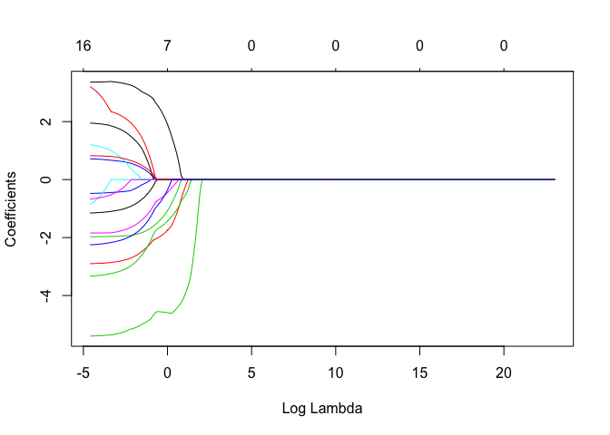
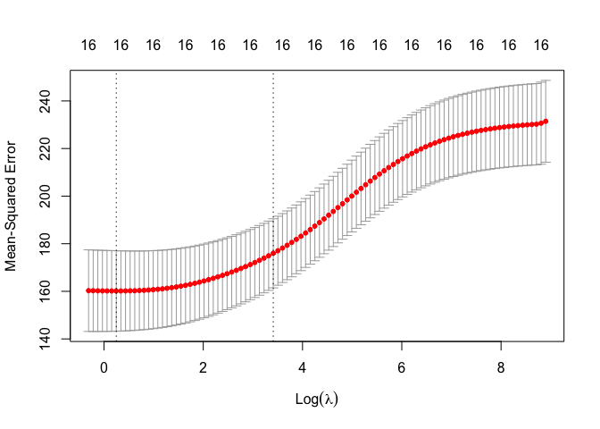
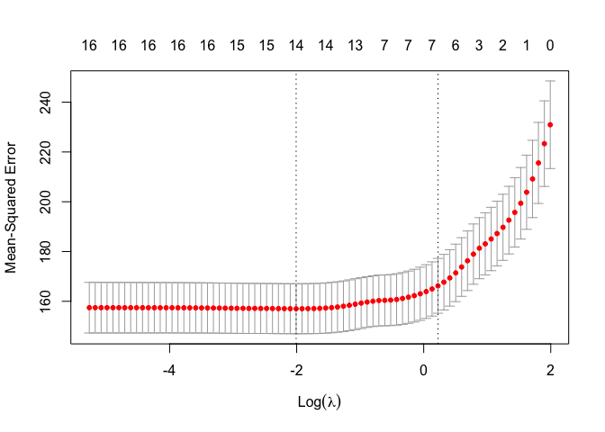
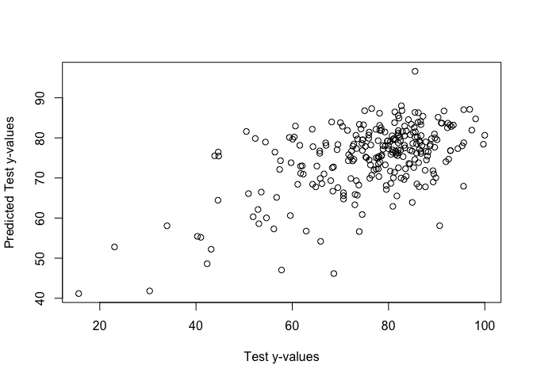
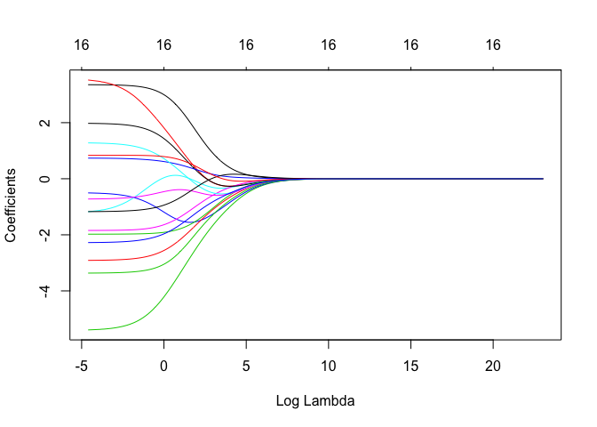

U.S. News and World Report’s College Data
=========================================

``` r
#libraries
library(tidyr)
library(dplyr)
```

    ## 
    ## Attaching package: 'dplyr'

    ## The following objects are masked from 'package:stats':
    ## 
    ##     filter, lag

    ## The following objects are masked from 'package:base':
    ## 
    ##     intersect, setdiff, setequal, union

``` r
library(ggplot2)
require(nnet)
```

    ## Loading required package: nnet

``` r
require(Ecfun)
```

    ## Loading required package: Ecfun

    ## 
    ## Attaching package: 'Ecfun'

    ## The following object is masked from 'package:base':
    ## 
    ##     sign

``` r
require(car)
```

    ## Loading required package: car

    ## Loading required package: carData

    ## 
    ## Attaching package: 'car'

    ## The following object is masked from 'package:dplyr':
    ## 
    ##     recode

``` r
require(ISLR)
```

    ## Loading required package: ISLR

``` r
require(MASS)
```

    ## Loading required package: MASS

    ## 
    ## Attaching package: 'MASS'

    ## The following object is masked from 'package:dplyr':
    ## 
    ##     select

``` r
require(glmnet)
```

    ## Loading required package: glmnet

    ## Loading required package: Matrix

    ## 
    ## Attaching package: 'Matrix'

    ## The following objects are masked from 'package:tidyr':
    ## 
    ##     expand, pack, unpack

    ## Loaded glmnet 3.0-2

``` r
#setup


College2 = data.frame(PctAccept=100*(College$Accept/College$Apps),College[,-c(2:3)])


attach(College)

College4 = data.frame(logApps=log(Apps),Private,logAcc=log(Accept),logEnr=log(Enroll),Top10perc,
                      Top25perc,logFull=log(F.Undergrad),logPart=log(P.Undergrad),Outstate,Room.Board,Books,Personal,PhD,Terminal,S.F.Ratio,perc.alumni,logExp=log(Expend),Grad.Rate)

detach(College)

X = model.matrix(PctAccept~.,data=College2)[,-1]
y = College2$PctAccept
```

We split the data into a training set and a test set by forming the indices for the training and test sets. Use p = .667, i.e. use two-thirds of the data to train the models. Note: That none of commands below show fitting to just a training set! (1 pt.)
-------------------------------------------------------------------------------------------------------------------------------------------------------------------------------------------------------------------------------------------------------------

``` r
set.seed(1)
sam = sample(1:length(y), floor(.667*length(y)), replace = F)
```

We created this index vector (where length y is the number of rows) to
be used as a way to single out a training and test set

We fit an OLS model for number of applications using the training set, and report the mean RMSEP for the test set. (4 pts.)
---------------------------------------------------------------------------------------------------------------------------

``` r
X = model.matrix(PctAccept~.,data=College2)[,-1]
y = College2$PctAccept
Xs = scale(X)
College2.temp = data.frame(y,Xs)
PA.ols = lm(y~Xs,data=College2.temp,subset=sam)
ypred = predict(PA.ols,newdata=College2.temp[-sam,])
```

    ## Warning: 'newdata' had 259 rows but variables found have 777 rows

``` r
RMSEP.ols = sqrt(mean((y[-sam]-ypred)^2))
RMSEP.ols
```

    ## [1] 16.35887

> RMSEP.ols 16.82557

We fit a sequence of ridge and lasso regression models on the training data set using the commands below given for the ridge models. The lambda sequence (grid) is formed to create the sequence of models. We create two plots showing the parameter shrinkage, one with the norm constraint on the x-axis and one with log lambda values on the x-axis.
---------------------------------------------------------------------------------------------------------------------------------------------------------------------------------------------------------------------------------------------------------------------------------------------------------------------------------------------------------

``` r
grid = 10^seq(10,-2,length=200)
ridge.mod = glmnet(Xs[sam,],y[sam],alpha=0,lambda=grid)

lasso.mod = glmnet(Xs[sam,],y[sam],alpha=1,lambda=grid)

plot(ridge.mod) 
```


``` r
plot(ridge.mod,xvar="lambda") 
```


Both using lambda and the L1 norm tell the same story in different
scales. Overall, they look fairly stadnard and we can definetly see that
certain varaibles are more important that others by a noatable margain.
From the plot with x = lambda we also can note that likley would never
want a lambda value greater than 5, as subesquent increases won’t have
any notable impact. It will be interesting to see how this stacks up
against the LASSO versions

``` r
plot(lasso.mod) 
```

    ## Warning in regularize.values(x, y, ties, missing(ties)): collapsing to
    ## unique 'x' values


``` r
plot(lasso.mod,xvar="lambda") 
```



As expected, Lasso is much more contrasting and rigid with its
regularization, capping out with a lambda closer to 4 and showing
certain varaibles to be leeps and bounds ahead of others. Furthermore,
for both ridge and LASSO, while the overall lambda values shown may be
much smaller then many of the examples we looked at, given that the
college dataset only has 18 to start with, narrowing it down to even sub
5 is an admirable result. However, these plots alone are not a preffered
way to choose lambda, as cross-validation tends to be much more prescise
in that regard.

Using cross-validation to determine the “optimal” values for the shrinkage parameter for both ridge and lasso and plot the results.
-----------------------------------------------------------------------------------------------------------------------------------

``` r
cv.out_ridge = cv.glmnet(Xs[sam,],y[sam],alpha=0)
plot(cv.out_ridge)
```



``` r
bestlam_ridge = cv.out_ridge$lambda.min
bestlam_ridge
```

    ## [1] 1.281041

``` r
# 0.7006997


cv.out_lasso = cv.glmnet(Xs[sam,],y[sam],alpha=1)
plot(cv.out_lasso)
```



``` r
bestlam_lasso = cv.out_lasso$lambda.min
bestlam_lasso
```

    ## [1] 0.1342038

``` r
# 0.1065001
```

Using the optimal lambda (bestlam) for both ridge and Lasso regression, we fit both models and compare the estimated coefficients for the OLS, ridge, and Lasso regressions.
----------------------------------------------------------------------------------------------------------------------------------------------------------------------------

``` r
lasso.mod = glmnet(Xs[sam,], y[sam], alpha = 1, lambda = bestlam_lasso)
lasso.pred = predict(lasso.mod, newx = Xs[-sam,])

coef(lasso.mod)
```

    ## 17 x 1 sparse Matrix of class "dgCMatrix"
    ##                     s0
    ## (Intercept) 74.2782424
    ## PrivateYes   3.2152233
    ## Enroll       1.8533614
    ## Top10perc   -5.1233543
    ## Top25perc   -0.3341361
    ## F.Undergrad  .        
    ## P.Undergrad -1.5962736
    ## Outstate     1.4048898
    ## Room.Board  -2.6620104
    ## Books       -1.9073798
    ## Personal     0.5296245
    ## PhD          0.2792780
    ## Terminal     .        
    ## S.F.Ratio   -0.8713244
    ## perc.alumni  0.6186085
    ## Expend      -2.9018913
    ## Grad.Rate   -1.8937267

``` r
# 17 x 1 sparse Matrix of class "dgCMatrix"
# s0
# (Intercept) 74.78642725
# PrivateYes   2.97828704
# Enroll       1.88664016
# Top10perc   -5.12584834
# Top25perc    .         
# F.Undergrad  .         
# P.Undergrad -1.46944963
# Outstate     1.52456756
# Room.Board  -2.84813667
# Books       -1.09240424
# Personal     0.08458621
# PhD          .         
# Terminal     0.18881525
# S.F.Ratio   -1.50029175
# perc.alumni  0.39489197
# Expend      -3.48052571
# Grad.Rate   -1.89225948


ridge.mod = glmnet(Xs[sam,], y[sam], alpha = 0, lambda = bestlam_lasso)
ridge.pred = predict(ridge.mod, newx = Xs[-sam,])

coef(ridge.mod)
```

    ## 17 x 1 sparse Matrix of class "dgCMatrix"
    ##                     s0
    ## (Intercept) 74.2925714
    ## PrivateYes   3.3192856
    ## Enroll       3.0331949
    ## Top10perc   -5.1840562
    ## Top25perc   -0.6404216
    ## F.Undergrad -0.7377095
    ## P.Undergrad -1.8249602
    ## Outstate     1.8973906
    ## Room.Board  -2.8616885
    ## Books       -1.9701122
    ## Personal     0.7131275
    ## PhD          1.1832746
    ## Terminal    -0.6697476
    ## S.F.Ratio   -1.1382127
    ## perc.alumni  0.8349835
    ## Expend      -3.3250787
    ## Grad.Rate   -2.2261292

``` r
# 17 x 1 sparse Matrix of class "dgCMatrix"
# s0
# (Intercept) 74.80034676
# PrivateYes   3.05989001
# Enroll       3.84015012
# Top10perc   -5.23619146
# Top25perc   -0.09616916
# F.Undergrad -1.79839190
# P.Undergrad -1.55654831
# Outstate     1.88266710
# Room.Board  -3.01241402
# Books       -1.17509769
# Personal     0.27983585
# PhD          0.13618524
# Terminal     0.36713206
# S.F.Ratio   -1.67566162
# perc.alumni  0.52068348
# Expend      -3.84823795
# Grad.Rate   -2.19810475


#compare to OLS


coef(PA.ols)
```

    ##   (Intercept)  XsPrivateYes      XsEnroll   XsTop10perc   XsTop25perc 
    ##    74.2958687     3.3547579     3.6393426    -5.4151974    -0.4896388 
    ## XsF.Undergrad XsP.Undergrad    XsOutstate  XsRoom.Board       XsBooks 
    ##    -1.2915070    -1.8441877     1.9806690    -2.9151817    -1.9780636 
    ##    XsPersonal         XsPhD    XsTerminal   XsS.F.Ratio Xsperc.alumni 
    ##     0.7383929     1.2889255    -0.7281067    -1.1766801     0.8339128 
    ##      XsExpend   XsGrad.Rate 
    ##    -3.3684036    -2.2834184

``` r
# (Intercept)  XsPrivateYes      XsEnroll   XsTop10perc   XsTop25perc XsF.Undergrad XsP.Undergrad    XsOutstate  XsRoom.Board 
# 74.8034528     3.0824234     4.5978281    -5.4983918     0.1320567    -2.5290500    -1.5431593     1.9605473    -3.0547464 
# XsBooks    XsPersonal         XsPhD    XsTerminal   XsS.F.Ratio Xsperc.alumni      XsExpend   XsGrad.Rate 
# -1.1763839     0.2956915     0.1537753     0.3688423    -1.7119667     0.5165208    -3.8963058    -2.2630644 
```

We see similar themes in all three for certain variable getting
effictvely dropped, with Top25perc and PHD particularly not being liked
by any of these methods. Moreover, variables such as privateyes, enroll,
expend, and top10percent are focused by all of them as well, does bode
well the overall determination of the importance of them. However, the
real differences between the three occur in how harsh and how widespread
their zeroing out is. Ridge is by far the wide spread in its punishment,
as it effectively is removing roughly 5 variables by setting them to
near zero. Lasso is more lowering across the board, but only completely
commits to removing just 4 of them. OLS, meanwhile, is much more
conservative dut to the nature of its functionality and only heavily
demphasises a few key variables like the ones discussed earlier without
truly removing anything.

We construct a plot of the predicted test y values vs. the actual y test values for both the ridge and Lasso regression models. Discuss. (4 pts.)
-------------------------------------------------------------------------------------------------------------------------------------------------

``` r
plot(y[-sam],predict(ridge.mod,newx=Xs[-sam,]),xlab="Test y-values",ylab="Predicted Test y-values")
```



``` r
plot(y[-sam],predict(lasso.mod,newx=Xs[-sam,]),xlab="Test y-values",ylab="Predicted Test y-values")
```


While these models are not dreadful, they due seem to be a bit
impercise, particularly when dealing with lower cases, where massive
over predictions are common. However, as test cases get larger in value,
the models seems to a much more satisfactory job of landing on target.
As for comparisons, it is interesting to note that while ridge is
arguable a bit tighter in its predictions, they appear to be similar in
terms of the final result. However, we suspect that that this will not
be the case upon using a log transformed y into the log scale for
question i, as algrorithms such as this often perform similarly when
given inefficent data, though this simply conjecture

Using the optimal lambda (bestlam) for both ridge and Lasso regression, we find the mean RMSEP for the test set. We look at how the mean RMSEP compares for the OLS, ridge, and Lasso regression models.
--------------------------------------------------------------------------------------------------------------------------------------------------------------------------------------------------------

These models are already fit with their associated best lambda values.

``` r
RMSEP.ridge = sqrt(mean((y[-sam]-ridge.pred)^2))
RMSEP.ridge
```

    ## [1] 11.20777

``` r
# > RMSEP.ridge
# [1] 11.4058


lasso.pred = predict(lasso.mod, newx = Xs[-sam,])

RMSEP.lasso = sqrt(mean((y[-sam]-lasso.pred)^2))
RMSEP.lasso
```

    ## [1] 11.16651

``` r
# > RMSEP.lasso
# [1] 11.45826
```

Using Monte Carlo Split-Sample Cross-Validation to estimate the mean RMSEP for the OLS, Ridge, and Lasso regressions above. Which model has best predictive performance?
------------------------------------------------------------------------------------------------------------------------------------------------------------------------

``` r
# MLR.ssmc = function(fit,p=.667,M=100) {
#   RMSEP = rep(0,M)
#   MAEP = rep(0,M)
#   MAPEP = rep(0,M)
#   y = fit$model[,1]
#   x = fit$model[,-1]
#   data = fit$model
#   n = nrow(data)
#   for (i in 1:M) {
#     ss = floor(n*p)
#     sam = sample(1:n,ss,replace=F)
#     fit2 = lm(formula(fit),data=data[sam,])
#     ypred = predict(fit2,newdata=as.data.frame(x[-sam,]))
#     RMSEP[i] = sqrt(mean((y[-sam]-ypred)^2))
#     MAEP[i] = mean(abs(y[-sam]-ypred))
#     yp = ypred[y[-sam]!=0]
#     ya = y[-sam][y[-sam]!=0]
#     MAPEP[i]=mean(abs(yp-ya)/ya)
#   }
#   cat("RMSEP =",mean(RMSEP),"  MAEP=",mean(MAEP),"  MAPEP=",mean(MAPEP))
#   cv = return(data.frame(RMSEP=RMSEP,MAEP=MAEP,MAPEP=MAPEP))
# }
# 
# 
# 
# ols.results = MLR.ssmc(fit = PA.ols, M = 1000)
# 
# # ols.results = MLR.ssmc(fit = PA.ols, M = 1000)
# # RMSEP = 17.20675   MAEP= 13.12478   MAPEP= 0.2195358
# 
# 
# 
# 
# glmnet.ssmc = function(X,y,p=.667,M=100,alpha=1,lambda=1) {
#   RMSEP = rep(0,M)
#   MAEP = rep(0,M)
#   MAPEP = rep(0,M)
#   n = nrow(X)
#   for (i in 1:M) {
#     ss = floor(n*p)
#     sam = sample(1:n,ss,replace=F)
#     fit = glmnet(X[sam,],y[sam],lambda=lambda,alpha=alpha)
#     ypred = predict(fit,newx=X[-sam,])
#     RMSEP[i] = sqrt(mean((y[-sam]-ypred)^2))
#     MAEP[i] = mean(abs(y[-sam]-ypred))
#     yp = ypred[y[-sam]!=0]
#     ya = y[-sam][y[-sam]!=0]
#     MAPEP[i]=mean(abs(yp-ya)/ya)
#   }
#   cat("RMSEP =",mean(RMSEP),"  MAEP=",mean(MAEP),"  MAPEP=",mean(MAPEP))
#   cv = return(data.frame(RMSEP=RMSEP,MAEP=MAEP,MAPEP=MAPEP)) 
# }
# 
# 
# ols.results = MLR.ssmc(fit = PA.ols, M = 1000)
# 
# # RMSEP = 17.20675   MAEP= 13.12478   MAPEP= 0.2195358
# 
# ridge.results = glmnet.ssmc(Xs,y,M=1000,alpha=0,lambda=bestlam_ridge)
# 
# # RMSEP = 12.15456   MAEP= 9.547365   MAPEP = 0.1508027
# 
# lasso.results = glmnet.ssmc(Xs,y,M=1000,alpha=0,lambda=bestlam_lasso)
# 
# # RMSEP = 12.14273   MAEP= 9.538953   MAPEP= 0.1500236
```

Thoguh it wasn’t by much, the lasso model was ever so slightly better
then ridge across all metrics. However, the difference is so miniscule
that it likey would have little impact on the larger result. Was is much
more telling is how poorly the OLS model did by comparison, as itwas
outclassed by nearly 7% in MAPE by both models in addition to lagging
behind in the RMSEP abd MAE departments. In this case, either the full
ridge or LASSO would be fairly useful.

Split the data into a training set and a test set by forming the indices for the training and test sets. Using p = .667, i.e. using two-thirds of the data to train the models.
-------------------------------------------------------------------------------------------------------------------------------------------------------------------------------

we once again can use this same vector as a means to seperate our
training and test set

``` r
set.seed(1)
sam = sample(1:length(y), floor(.667*length(y)), replace = F)
```

Fitting an OLS model for number of applications using the training set, and reporting the mean RMSEP for the test set.
----------------------------------------------------------------------------------------------------------------------

``` r
X = model.matrix(PctAccept~.,data=College2)[,-1]
y = College2$PctAccept
Xs = scale(X)
College2.temp = data.frame(y,Xs)
PA.ols = lm(y~Xs,data=College2.temp,subset=sam)
ypred = predict(PA.ols,newdata=College2.temp[-sam,])
```

    ## Warning: 'newdata' had 259 rows but variables found have 777 rows

``` r
RMSEP.ols = sqrt(mean((y[-sam]-ypred)^2))
RMSEP.ols
```

    ## [1] 16.35887

``` r
#> RMSEP.ols
#[1] 16.82557
```

We fit a sequence of ridge and lasso regression models on the training data set using the commands below given for the ridge models. The lambda sequence (grid) is formed to create the sequence of models. We create two plots showing the parameter shrinkage, one with the norm constraint on the x-axis and one with log lambda values on the x-axis.
---------------------------------------------------------------------------------------------------------------------------------------------------------------------------------------------------------------------------------------------------------------------------------------------------------------------------------------------------------

training model versions

``` r
grid = 10^seq(10,-2,length=200)
ridge.mod = glmnet(Xs[sam,],y[sam],alpha=0,lambda=grid)

lasso.mod = glmnet(Xs[sam,],y[sam],alpha=1,lambda=grid)


plot(ridge.mod) 
```


``` r
plot(ridge.mod,xvar="lambda") 
```



These plots certainly look more exotic when used on this variable, aswe
can see certain columns being overtly important compared to there peers.
Moreover, it also appears that more variables are found closer to the
middle, meaning that we have found a greater dichotomy within the
predictors when looking at logApp compared to PctAcc. This could
potenitally allow for some more effective models. We also should try to
keep log lambda below 5

``` r
plot(lasso.mod) 
```

    ## Warning in regularize.values(x, y, ties, missing(ties)): collapsing to
    ## unique 'x' values


``` r
plot(lasso.mod,xvar="lambda") 
```


As if to put the ridge visuals to shame we see the massive importance of
a single variable when compared to other predictors. This make sense
given that we are now trying to predict whether or not a application was
submitted rather then acceptance, which is likely to be further
dominated by a singular variable due to the more fluid nature of the
response. Still, this level of strength in a single predictor is
uncommon and should be heavily considered as we continue to through our
process. The favored lambda here should be excessivly low.

Using cross-validation to determine the “optimal” values for the shrinkage parameter for both ridge and lasso and plot the results.
-----------------------------------------------------------------------------------------------------------------------------------

``` r
# cv.out_ridge4 = cv.glmnet(Xs[sam,],y[sam],alpha=0)
# plot(cv.out_ridge4)
# bestlam_ridge4 = cv.out_ridge4$lambda.min
# bestlam_ridge4

#  0.1053238

# 
# cv.out_lasso4 = cv.glmnet(Xs[sam,],y[sam],alpha=1)
# plot(cv.out_lasso4)
# bestlam_lasso4 = cv.out_lasso4$lambda.min
# bestlam_lasso4

# 0.001883874
```

Using the optimal lambda (bestlam) for both ridge and Lasso regression we fit both models and compare the estimated coefficients for the OLS, ridge, and Lasso regressions.
---------------------------------------------------------------------------------------------------------------------------------------------------------------------------

``` r
#IE Using the optimal lambda (bestlam) for both ridge and Lasso regression fit both models and compare the estimated coefficients for the OLS, ridge, and Lasso regressions. Discuss.  (3 pts.)

# 
# lasso.mod4 = glmnet(Xs[sam,], y[sam], alpha = 1, lambda = bestlam_lasso4)
# lasso.pred4 = predict(lasso.mod4, newx = Xs[-sam,])
# 
# coef(lasso.mod4)

# 18 x 1 sparse Matrix of class "dgCMatrix"
# s0
# (Intercept)  7.434554036
# PrivateYes  -0.050212639
# logAcc       0.978489742
# logEnr       .          
# Top10perc    0.120233645
# Top25perc   -0.013589483
# logFull      0.002427057
# logPart      .          
# Outstate    -0.035255855
# Room.Board   0.046391800
# Books        0.029873737
# Personal    -0.006419158
# PhD         -0.016155247
# Terminal     .          
# S.F.Ratio    0.018329497
# perc.alumni -0.005792954
# logExp       0.052494941
# Grad.Rate    0.025481693


# ridge.mod4 = glmnet(Xs[sam,], y4[sam], alpha = 0, lambda = bestlam_ridge4)
# ridge.pred4 = predict(ridge.mod4, newx = Xs[-sam,])
# 
# coef(ridge.mod4)

# 18 x 1 sparse Matrix of class "dgCMatrix"
# s0
# (Intercept)  7.431726e+00
# PrivateYes  -4.613620e-02
# logAcc       5.442206e-01
# logEnr       2.378991e-01
# Top10perc    5.841218e-02
# Top25perc    1.653745e-02
# logFull      1.535466e-01
# logPart      4.039733e-03
# Outstate     1.366960e-02
# Room.Board   6.627776e-02
# Books        2.905095e-02
# Personal    -7.616220e-03
# PhD          1.060173e-02
# Terminal     5.501221e-05
# S.F.Ratio    3.390973e-02
# perc.alumni -9.093081e-03
# logExp       7.079713e-02
# Grad.Rate    4.357336e-02

#compare to OLS


# coef(PA.ols4)

# (Intercept)  Xs4PrivateYes      Xs4logAcc      Xs4logEnr   Xs4Top10perc   Xs4Top25perc     Xs4logFull     Xs4logPart    Xs4Outstate 
# 7.434888467   -0.051106674    1.024491953   -0.085700196    0.143223598   -0.032688771    0.045728097   -0.003907068   -0.052228771 
# Xs4Room.Board       Xs4Books    Xs4Personal         Xs4PhD    Xs4Terminal   Xs4S.F.Ratio Xs4perc.alumni      Xs4logExp   Xs4Grad.Rate 
# 0.046303453    0.030927966   -0.009831579   -0.027649468    0.005828063    0.022345217   -0.005731006    0.062056412    0.031134728 
```

We once again see some similarities among the three, with variables such
as phd, terminal, gradrate, part, and a bunch of other variables that
would not seem to correlate with the response all being lowered in
priority. In addition, all three of these heavily emphasze the
acceptance variable which makes sense given that if somebody is
accepted, they almost assurdely sent in an application. Otherwise, we
patterns similar to what was desribed on the PctAccept variable in terms
of how each model punishes low performing variables. Although, OLS in
particular is much more restrained in not effectively zeroing out
certain variables this time around, with ridge also feeling a bitmore
conservative with how many it effectively zeroes out.

We construct a plot of the predicted test y values vs. the actual y test values for both the ridge and Lasso regression models.
-------------------------------------------------------------------------------------------------------------------------------

``` r
# plot(y4[-sam],lasso.pred,xlab="Test y-values",ylab="Predicted Test y-values")
```

``` r
# plot(y[-sam], lasso.pred,xlab="Test y-values",ylab="Predicted Test y-values")
```

These plots look nigh indistinguishable from each other, as each one is
so precise due to having such a highly correlated variable within the
model. Lasso looks ever so slightly more precise, and based on our
accuracy metric from before is likely the better model, but both of
these two would be more then effecitve going off of the graph alone.

These models are already fit with their associated best lambda values.
We will also undo the logs, as we likely want to predict outside of the
log scale.

``` r
# ridge.pred4 = predict(ridge.mod4, newx = Xs[-sam,])
# 
# ya = exp(y[-sam])
# ridge.ypred4a = exp(ridge.pred4)
# 
# RMSEP.ridge4 = sqrt(mean(ya[-sam]-ridge.ypred4a)^2)
# RMSEP.ridge4

# > RMSEP.ridge4
# [1] 1008.431

# lasso.pred4 = predict(lasso.mod4, newx = Xs[-sam,])
# 
# lasso.ypred4a = exp(lasso.pred4)
# 
# RMSEP.lasso4 = sqrt(mean(ya-lasso.ypred4a)^2)
# 
# RMSEP.lasso4


# > RMSEP.lasso4
# [1] 1098.562
```

While all of the models performed well, OLS was left in the dust with
its values of roughly 4.5, as both ridge and LASSO. Both get beneath 1
and are hovering around 1,000. As for which is better among the two,
much like previously while the answer is LASSO, the ridge is close
enough to the point that it practically does not matter. The methods are
likey to simply be to similar to get a meaningfully different results
when fed the same predictors. Still, if one were to try some amount of
elastic net one may be able to improve these metrics yet. This does not
discount the power of these models though, as they both are improvments.

We use Monte Carlo Split-Sample Cross-Validation to estimate the mean RMSEP for the OLS, Ridge, and Lasso regressions above. Which model has best predictive performance?
-------------------------------------------------------------------------------------------------------------------------------------------------------------------------

``` r
# MLR.ssmclog = function(fit,p=.667,M=100) {
#   RMSEP = rep(0,M)
#   MAEP = rep(0,M)
#   MAPEP = rep(0,M)
#   y = fit$model[,1]
#   x = fit$model[,-1]
#   data = fit$model
#   n = nrow(data)
#   for (i in 1:M) {
#     ss = floor(n*p)
#     sam = sample(1:n,ss,replace=F)
#     fit2 = lm(formula(fit),data=data[sam,])
#     ypred = predict(fit2,newdata=as.data.frame(x[-sam,]))
#     RMSEP[i] = sqrt(mean((exp(y[-sam])-exp(ypred))^2))
#     MAEP[i] = mean(abs(exp(y[-sam])-exp(ypred)))
#     yp = exp(ypred[y[-sam]!=0])
#     ya = exp(y[-sam][y[-sam]!=0])
#     MAPEP[i]=mean(abs(yp-ya)/ya)
#   }
#   cat("RMSEP =",mean(RMSEP),"  MAEP=",mean(MAEP),"  MAPEP=",mean(MAPEP))
#   cv = return(data.frame(RMSEP=RMSEP,MAEP=MAEP,MAPEP=MAPEP))
# }
# 
# 
# 
# 
# glmnet.sslog = function(X,y,p=.667,M=100,alpha=1,lambda=1) {
#   RMSEP = rep(0,M)
#   MAEP = rep(0,M)
#   MAPEP = rep(0,M)
#   n = nrow(X)
#   for (i in 1:M) {
#     ss = floor(n*p)
#     sam = sample(1:n,ss,replace=F)
#     fit = glmnet(X[sam,],y[sam],lambda=lambda,alpha=alpha)
#     ypred = predict(fit,newx=X[-sam,])
#     ya = exp(y[-sam])
#     ypred = exp(ypred)
#     RMSEP[i] = sqrt(mean((ya-ypred)^2))
#     MAEP[i] = mean(abs(ya-ypred))
#     MAPEP[i]=mean(abs(ypred-ya)/ya)
#   }
#   cat("RMSEP =",mean(RMSEP),"  MAEP=",mean(MAEP),"  MAPEP=",mean(MAPEP))
#   cv = return(data.frame(RMSEP=RMSEP,MAEP=MAEP,MAPEP=MAPEP))
#   
# }
# 


# ols.results = MLR.ssmclog(fit = PA.ols4, M = 1000)

# RMSEP = 5574.74   MAEP= 3335.772   MAPEP= 0.2528052

# glmnet.sslog(X,y, p=.667,M=100,alpha = 1, lambda = bestlam_lasso4)

# RMSEP = 1102.624   MAEP= 502.6463   MAPEP= 0.1447807

# glmnet.sslog(X,y, p=.667,M=100,alpha = 0, lambda = bestlam_ridge4)

# RMSEP = 1213.98   MAEP= 539.2485   MAPEP= 0.1777687
```

While the matchup was close and the lasso and ridge models were very
close, the lasso method came out on top by roughly 3% MAPE. Given its
more punishing nature and likelehood to focus on fewer varibles more,
this makes sense given that we were working with a small number of
variables. It should also be noted that both the ridge and the lasso
method blew the OLS by itself completely out of the water, speaking
volumes about just how effective shrinkage can be even on smaller
datasets.
